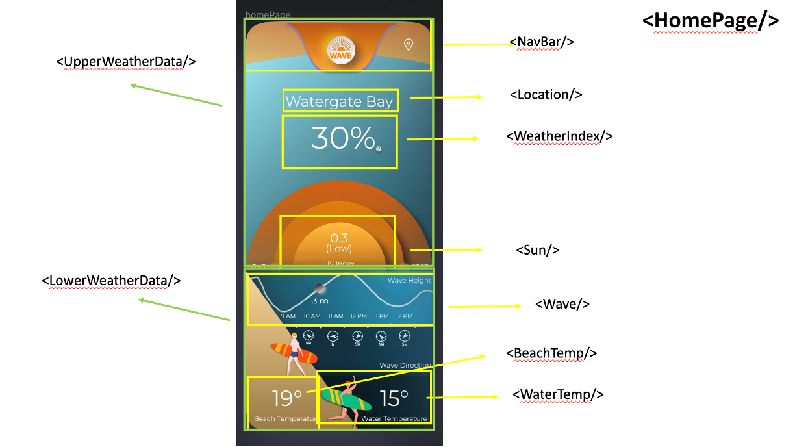

# Setup the first time

#### install "node" on your laptop
on Mac use:
 
<code>brew install node</code>
 
and follow the instructions

#### Clone the project
<code>git clone https://github.com/inbarbz/surf-app-preact.git</code>

#### Installing project packages
Open a terminal (in the project folder) and run:
 
<code>npm install --force</code>

# Running Dev server
open a terminal window in your Visual Code IDE and execute the command:
 
<code>npm run dev</code>

(and open a browser http://localhost:8080)

Open developer tools and select iPhone 12 Pro

# Stop the Dev server
in the terminal window press the key combination:
control-c

# Home page components

.

# Key Javascript packages & APIs in use
- Boostrap (for styling and layout). see https://getbootstrap.com/
- ChartJS (for the charts). see https://www.chartjs.org/
- Web API https://marine-api.open-meteo.com for the weather datanp
- 
